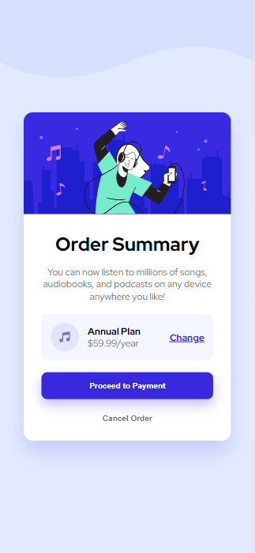

# Order Summary Component

This project is a responsive order summary card component, built with HTML and CSS. It's designed to showcase a subscription plan for a music streaming service.

## Features

- Responsive design that works on desktop and mobile devices
- Interactive elements with hover states
- Clean and modern UI following the provided design

## Preview




## Technologies Used

- HTML5
- CSS3
- Google Fonts (Red Hat Display)

## Setup

To run this project, simply clone the repository and open the `index.html` file in your web browser.

```bash
git clone https://github.com/Philip-Machar/order-summary-component.git
cd order-summary-component
Then open index.html in your preferred browser.

Structure

index.html - The main HTML document
style.css - The styles for the component
images/ - Directory containing all image assets

CSS Features

Flexbox for layout
Custom properties for colors
Hover effects on interactive elements
Box-shadow for depth
Background image for the body

